  

# **Hi there, I'm Jordan!** 👋

**From Network Architect to Full-Stack App Developer & DevOps Automation Engineer — powering AI-driven solutions in cloud ☁️ and enterprise environments 🏢.**

I'm a Network Architect turned Full-Stack App Developer & DevOps Automation Engineer, building resilient networks and intelligent applications on-premises and in the cloud. From architecting infrastructure blueprints to authoring Python, JavaScript, and TypeScript code, I streamline CI/CD pipelines and automate every step for maximum reliability. My goal is to empower teams with scalable, secure solutions that accelerate growth and let organizations focus on innovation rather than manual tasks.

## 📝 About Me

I'm a reliability, automation, and innovation enthusiast who believes in **proactive** over **reactive** solutions. Through my "Future Lazy Engineering" approach, I invest extra effort up front to anticipate edge cases, then deliver the bare-minimum, modular code that scales. By doing the work up front, I prevent the cascading tech debt of Band-Aid fixes—what might have been a quick two-hour patch can otherwise balloon into a 5–8 week project ⚠️.  

By day, I design and secure enterprise-scale networks 🌐; by night, I build React/TypeScript apps ⚛️, script Python automations 🐍, and weave AI 🤖 into every workflow.

**🎯 Signature Achievement:**  
I defined a minimal JSON schema and SDK-driven automation for SD-WAN provisioning (Meraki, Cisco, VeloCloud) that slashed deployment time from **1 hour per site** to **15 minutes for hundreds of sites**—all at the click of a button—so teams can focus on innovation, not firefighting. 🔥

---

  <table style="border: none; width: 100%;">
    <tr>
      <td width="60%" valign="top" style="border: none;">

## 🛠️ Technologies & Tools

### **Languages**

  
  
  
  
  

**Python 🐍** _Proficient • Daily production automations_  
**JavaScript & TypeScript ⚙️** _Proficient • Full-stack applications_  
**Bash 📟** _Comfortable • CI/CD scripting_  
**Ruby 💎** _Familiar • Occasional use_

### **Frameworks & Libraries**

  
  
  
  

**React ⚛️** _Proficient • Multiple client applications_  
**Next.js 🚀** _Proficient • SSR & static sites_  
**Node.js 🟢** _Proficient • API services & automation bots_  
**n8n 🔄** _Proficient • Workflow automation platforms_

### **Infrastructure & DevOps**

  
  
  
  

**Docker 🐳** _Proficient • Containerized deployments_  
**Terraform 🌍** _Proficient • Infrastructure as Code_  
**Ansible 🤖** _Familiar • Configuration management_  
**Jenkins 🎛️** _Proficient • CI/CD pipelines_

### **Cloud & Platforms**

  
  
  

**AWS ☁️** _Proficient • Primary cloud infrastructure_  
**Azure 🔷** _Familiar • Secondary cloud projects_  
**Cisco Meraki & VeloCloud 🔌** _Proficient • Network automation SDKs_

### **Databases & Storage**

  
  
  
  

**PostgreSQL 🐘** _Proficient • Schema design & operations_  
**MySQL 🦊** _Proficient • Relational database management_  
**MongoDB 🍃** _Proficient • Document store solutions_  
**Redis 🗄️** _Familiar • Caching and session storage_

      </td>
      <td width="40%" valign="top" style="border: none;">

## 📊 GitHub Metrics

### **AI/ML & Emerging Tech**

  
  
  

**scikit-learn, TensorFlow, PyTorch 📊**  
_Exploring • Machine learning prototypes_

**LangChain & RAG Pipelines 📚**  
_Exploring • AI-powered automation tools_

### **Development Tools**

  
  
  

**Git & GitHub 🐙** _Proficient • Advanced branching strategies_  
**VS Code 📝** _Daily driver • Extensions & customization_  
**AI Assistants 🤖** _OpenAI Codex, Claude Code, Copilot_  
**Network Tools 📡** _Wireshark, TCPdump for troubleshooting_

      </td>
    </tr>
  </table>

---

## 📫 Connect with Me

  
  
  

---

  

