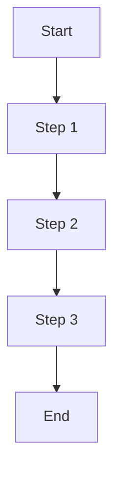

---
ai_context:
  model_requirements:
    context_window: 8k_tokens
    memory_format: sequential
    reasoning_depth: optional
    attention_focus: process
  context_dependencies:
    - /docs/01-project/00-templates/00-ai_header.md
    - /docs/00-notes/02-documentation_structure_guide.md
  context_chain:
    previous: /docs/01-project/00-templates/01-tracking.md
    next: /docs/01-project/00-templates/03-technical.md
  metadata:
    created: 2026-02-04 12:00:00 PM CST
    updated: 2026-02-04 11:53:50 AM CST
    version: v1.0.0
    category: template
    status: active
    revision_id: "template-guide-001"
    parent_doc: "/docs/01-project/00-templates/README.md"
    abstract: "Canonical template for docs-only step-by-step guides."
---
# Guide Template

- **Path:** `/docs/01-project/00-templates/02-guide.md`
- **Last Updated:** (template; see YAML `metadata.updated`)

## Template Notes (read first)
- This file is a **template**. When you copy it, replace placeholders like `<...>`.
- Prefer repo-rooted links for docs (e.g., `/docs/...`).
- Keep the visible “Last Updated” line aligned to YAML `metadata.updated` in real docs.

## Prerequisites
Before starting this guide, ensure you have:
1. Prerequisite 1
2. Prerequisite 2
3. Prerequisite 3

## Process Flow

## Step-by-Step Guide

### 1. First Step
1. Action 1
2. Action 2
3. Action 3

### 2. Second Step
1. Action 1
2. Action 2
3. Action 3

### 3. Third Step
1. Action 1
2. Action 2
3. Action 3

## Validation Checklist
- [ ] Check 1
- [ ] Check 2
- [ ] Check 3

## Troubleshooting

### Common Issues
1. **Issue 1**
   - Symptom: Description
   - Cause: Explanation
   - Solution: Steps to resolve
   
2. **Issue 2**
   - Symptom: Description
   - Cause: Explanation
   - Solution: Steps to resolve

## Best Practices
1. Best practice 1
2. Best practice 2
3. Best practice 3

## References
- Reference 1
- Reference 2
- Reference 3

## Related Guides
- Related guide 1
- Related guide 2
- Related guide 3 

## Change Log
- 2026-02-04 - Refreshed template to match docs-only conventions (see YAML `metadata.updated`)