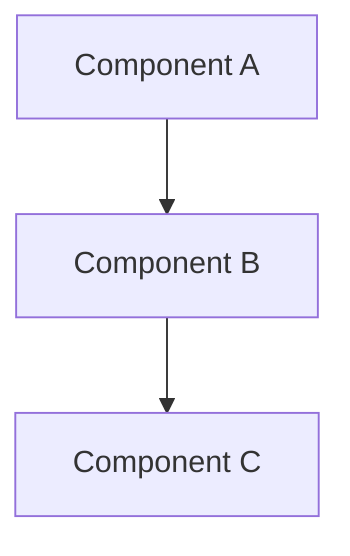

---
ai_context:
  model_requirements:
    context_window: 16k_tokens
    memory_format: hierarchical
    reasoning_depth: required
    attention_focus: technical
  context_dependencies:
    - /docs/01-project/00-templates/00-ai_header.md
    - /docs/00-notes/02-documentation_structure_guide.md
  context_chain:
    previous: /docs/01-project/00-templates/02-guide.md
    next: null
  metadata:
    created: 2026-02-04 12:00:00 PM CST
    updated: 2026-07-07 11:24:48 AM CDT
    version: v1.0.1
    category: template
    status: active
    revision_id: "template-technical-002"
    parent_doc: "/docs/01-project/00-templates/README.md"
    abstract: "Canonical template for docs-only technical specifications and design docs."
---
# Technical Doc Template

- **Path:** `/docs/01-project/00-templates/03-technical.md`
- **Last Updated:** 2026-07-07 11:24:48 AM CDT

## Template Notes (read first)
- This file is a **template**. When you copy it, replace placeholders like `<...>`.
- Prefer repo-rooted links for docs (e.g., `/docs/...`).
- Keep the visible “Last Updated” line aligned to YAML `metadata.updated` in real docs.

## System Overview
[High-level description of the technical system or component]

## Architecture


## Implementation Details
```text
// Replace this block with real code and a real language identifier (e.g., ts, js, py).
function example() {
  // Implementation details
}
```

## Security Considerations
- **Authentication** — [how identity is verified]
- **Authorization** — [access-control / permissions model]
- **Data protection** — [encryption at rest / in transit, PII handling]
- **Audit logging** — [which security events are recorded]

## Performance Requirements
| Operation | Target | Maximum |
|-----------|--------|---------|
| Operation 1 | target | max |
| Operation 2 | target | max |

## Error Handling
```text
// Replace this block with real code and a real language identifier.
try {
  // Implementation
} catch (error) {
  // Error handling
}
```

## Monitoring and Metrics
- Key metric 1
- Key metric 2
- Key metric 3

## Dependencies
- Dependency 1
- Dependency 2
- Dependency 3

## References
- Reference 1
- Reference 2
- Reference 3

## API Reference
### Endpoints/Methods
#### `methodName(param: Type): ReturnType`
- Description
- Parameters
- Return value
- Examples

## Performance Considerations
- Bottlenecks
- Optimization strategies
- Monitoring points

## Testing
- Unit tests
- Integration tests
- Performance tests
- Security tests

## Related Documentation
- Link to related doc 1
- Link to related doc 2

## Change Log
- [Date] - Initial creation
  - Added section 1
  - Added section 2 

- 2026-02-04 - Refreshed template to match docs-only conventions (see YAML `metadata.updated`)
- 2026-07-07 - v1.0.1: enriched Security Considerations with Authentication/Authorization/Data-protection/Audit-logging detail (merged from doc_standards variant)